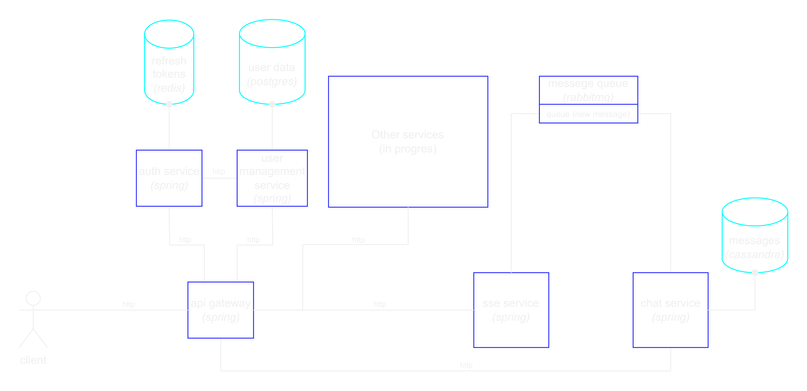

# Web-Application "RedNet"
Social network for data exchange, discussions, organization of events and communities

## Project Description

### Provided Features
#### 1.	Authentication and authorization
#### 2. Communication
#### 3. Viewing text, graphic and audio content
#### 4. Creating communities
#### 5. Creating events in communities 

### User interface design

## Get Started Instruction

## Project Design

## Technology Stack
BackEnd stack:

FrontEnd stack:

